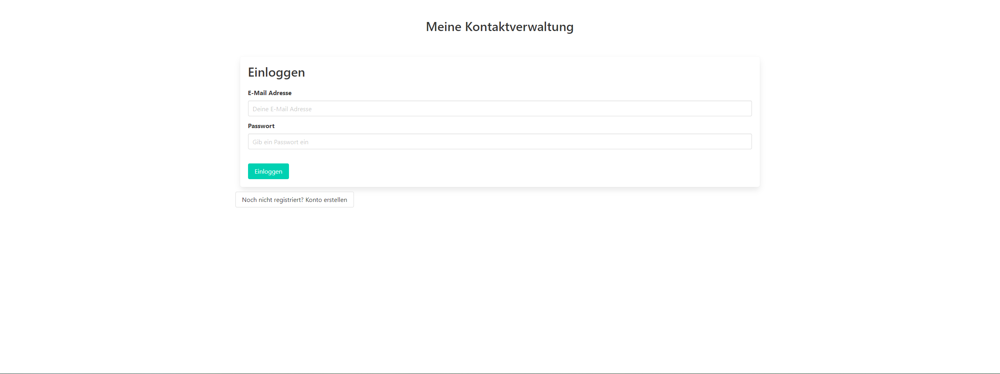
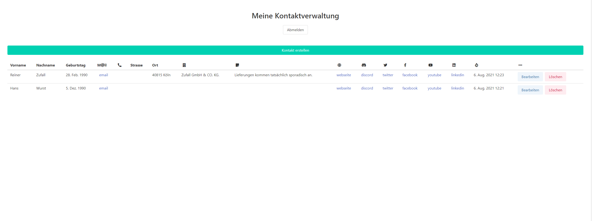
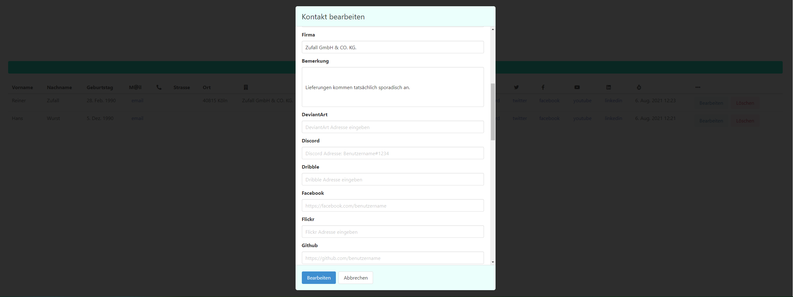

# React-FastAPI

  [visit](https://contacts.noconcept.dev) 

## Frontend

Simple Frontend for Demo purposes

## Backend

[visit](https://contact-api.noconcept.dev/docs) 

First rename the file `.env-sample` to `.env` and change the JWT_SECRET value.

_For a quick random key you can visit [https://randomkeygen.com/](https://randomkeygen.com/)_

### Create VirtualEnvironment and install Dependencies

To create the Environment `cd` into the `backend` folder with a Terminal

- run `python -m venv .venv`
  - with linux\* `python3 -m venv .venv`
- activate with `.\venv\Script\activate`
  - with linux\* `source .venv/bin/activate`
- install packages with `pip -r install requirements.txt`
  - with linux `pip3 -r install requirements.txt`

### Create Database

- To create the Sqlite Database `cd` into the `backend` folder activate your venv (see above) and install the dependencies also!
  - now run the `python` command (to enter the python console)
- In the python console run
  - first `import services`
  - second `services.create_database()`

### Run Backend Server

To run Backend Server `cd` into the `backend` folder activate your venv (see above) and install the dependencies also!

- then run `uvicorn main:app --reload`
- open [http://127.0.0.1:8000/docs](http://127.0.0.1:8000/docs)
